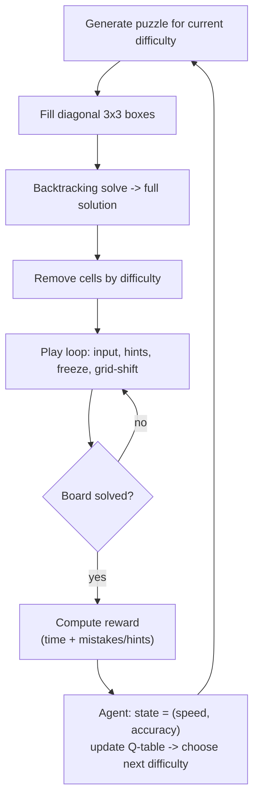

# AI-Enhanced Sudoku

> A playable Pygame Sudoku that **adapts its difficulty to you** using a lightweight reinforcement-learning-style agent, backed by a classic backtracking solver and generator.


After every board you finish, an agent looks at *how fast* and *how accurately* you played, scores the round as a reward, and picks the difficulty of your next puzzle (easy / medium / hard). Beyond plain Sudoku, the game adds twists — limited hints, a cell **freeze** mechanic with a cooldown, and a periodic **grid shift** that keeps you on your toes.

## Features

- 🧩 **Procedural puzzles**: diagonal-box seeding + backtracking solver guarantee a unique, valid board
- 🤖 **Adaptive difficulty**: a Q-table agent maps your (speed, accuracy) state to the next difficulty
- 💡 **Hints**: reveal a correct cell on demand
- ❄️ **Freeze**: lock a cell (with a cooldown) to protect it from the grid shift
- 🔀 **Grid shift**: every few correct moves, some cells reshuffle
- 📊 **Live stats sidebar**: time, mistakes, hints left, cooldown, current difficulty

---

## How It Works



The agent (`RLAgent`) buckets performance into a discrete state and keeps a reward table per `(state, action)`:

```python
def get_state(self, time_taken, mistakes):
    speed    = 'fast' if time_taken < 180 else 'medium' if time_taken < 360 else 'slow'
    accuracy = 'accurate' if mistakes < 3 else 'medium' if mistakes < 6 else 'inaccurate'
    return (speed, accuracy)
```

---

## Controls

| Action | Input |
|--------|-------|
| Select a cell | Mouse click |
| Enter a number | `1`–`9` |
| Hint | `H` |
| Freeze / unfreeze selected cell | `F` |
| Quit | Close window |

---

## Getting Started

```bash
pip install -r requirements.txt
python Ai_Project.py
```
Requires Python 3.9+ and a desktop environment (Pygame opens a window).

---

## Project Structure

```
Ai_Project.py                       game loop, solver/generator, RLAgent, rendering
```

---

## Notes & Possible Extensions

- The agent is intentionally simple: it accumulates reward per state/action rather than running full temporal-difference updates. A natural upgrade is proper **Q-learning** (learning rate + discount + ε-greedy exploration) so difficulty selection improves over many sessions.

---

## Author

**Muhammad Wajih Hyder** — BS Computer Science, FAST‑NUCES (2026)
[GitHub @wajihhyder](https://github.com/wajihhyder) · wajihhyder22@gmail.com
